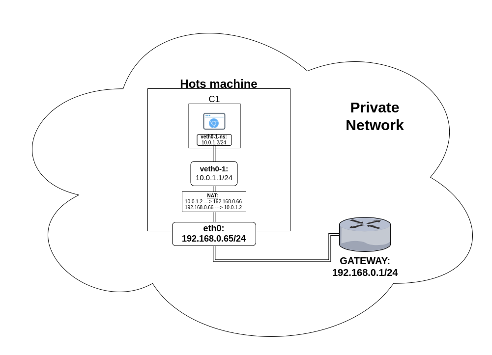

# Intstructions and requirements
 - Requirements: *chromium-browser*
 This script generate a number of virtual client using Network Namespaces: one client is identified by a source IP address.
 The input of the script must be:
  1. The name of the list containing only websites without comments or special characters (e.g. *https://www.ubuntu.com* ) 
  2. Number of desired clients
  3. Number of website request per second
  4. The address of the real subnet the host machine uses to go on internet (e.g. *XXX.XXX.XXX* do not include last point)
  5. Subnet mask relative to the subnet declared in [4]
  6. The name of the interface that face on the subnet declared in [4]
  7. Starting IP address to assign (this script will add multiple IP addresses to the interface. Take in account all reserved  addresses and all assigned addresses).
  
# Recommendations
   - Use this script in a virtual environment
   - Assign to the host machine a low ip address so the script can create more clients
   - The limit for the number of clients is 240 considering 3 reserved IP addresses and at least 12 hosts in the subnet
  
# Goal
This script will start an headless version of chromium-browser in order to emulate the browsing of a webpage without graphics.

